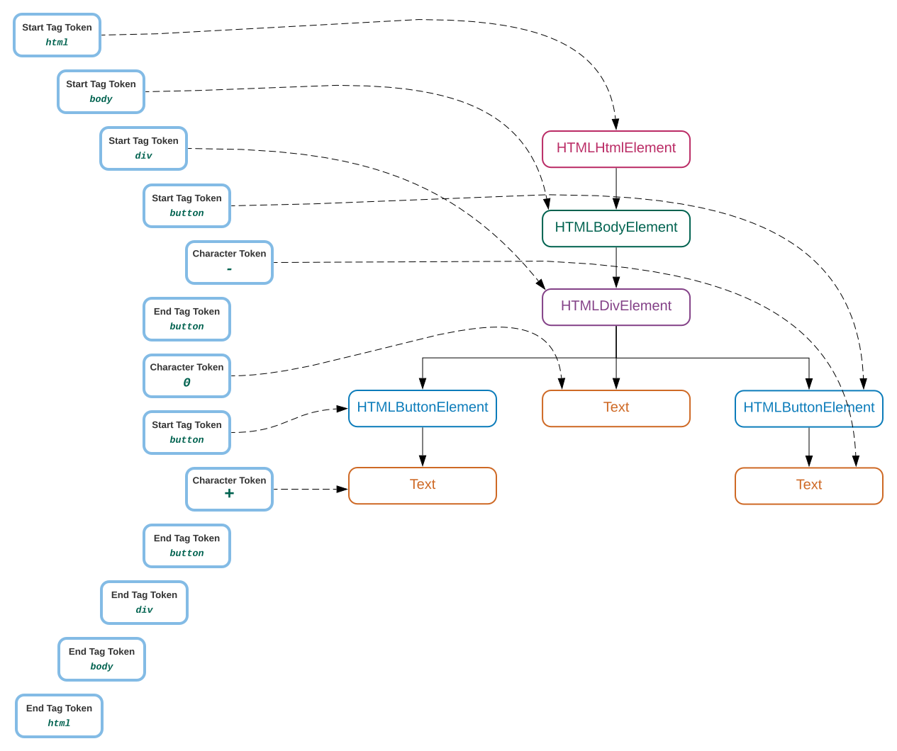

# Chapter 3 - 4
## 04/15/2021
## HTML Introduction
HTML is the standard markup language for creating Web pages.

### What is HTML?
- HTML stands for Hyper Text Markup Language
- HTML is the standard markup language for creating Web pages
- HTML describes the structure of a Web page 
- HTML consists of a series of elements
- HTML elements tell the browser how to display the content
- HTML elements label pieces of content such as "this is a heading", "this is a paragraph", "this is a link", etc.

HTML DOM - html document object model
    this is where you find the web page elements and their 'description'.
```html
<!DOCTYPE html>
<html>
<head>
<title>Page Title</title>
</head>
<body>

<h1>My First Heading</h1>
<p>My first paragraph.</p>

</body>
</html>
```  

### Elements of HTML forms


----

***NOTE: Find out more about http messages and popular status codes [here](https://www.w3schools.com/tags/ref_httpmessages.asp)***

#### Homework: 
Read about different message types, this will help you to understand the API and messages used in an API as a connection between server and webpage(local on the browser)
Note: remember status codes: 200, 401, 404, 500, 300, 201

---

### What type of Elements we can see on the web page?
Element types are defined by tags in the HTML document (DOM)
- images 
```html

```

- buttons 
```html
<button name="submit" id="login" type="button">Login</button>

```  
- links 
```html
<a href="https://www.w3schools.com">Visit W3Schools.com!</a>
```  
- text box, checkbox, radio button, password etc.
The ```<input>``` tag specifies an input field where the user can enter data.
  
The different input types are as follows:
```html
<input type="button">
<input type="checkbox">
<input type="color">
<input type="date">
<input type="datetime-local">
<input type="email">
<input type="file">
<input type="hidden">
<input type="image">
<input type="month">
<input type="number">
<input type="password">
<input type="radio">
<input type="range">
<input type="reset">
<input type="search">
<input type="submit">
```  
Sample:
```html
<form action="/action_page.php">
  <label for="fname">First name:</label>
  <input type="text" id="fname" name="fname"><br><br>
  <label for="lname">Last name:</label>
  <input type="text" id="lname" name="lname"><br><br>
  <input type="submit" value="Submit">
</form>
```  
- drop down 
```html
<select><option>NY</option>State</select>

```  
- checkbox
- radio buttons
- videos 

Find out about different tags used in the html document [here](https://www.w3schools.com/tags/tag_span.asp)

### Attributes
Each element consist of attributes 
```html
<div class="myDiv" id="my-div">
  <h2>This is a heading in a div element</h2>
  <p>This is some text in a div element.</p>
</div>
```
here 'div' is a tag and 'class' is an attribute.
type

### Using chrome developers tools options to inspect web elements
-  <h4 style=color:purple>Tags are purple</h4>
- <h4 style=color:red>Attributes are in red</h4>
- <h4 style=color:blue>Values of the attributes will be in blue</h4>
- <h4 style=color:black>text in the elements, that are in the tags, will be in black</h4>

---

## Selenium WebDriver: Finding Elements (locating) on the Web page.

We need to tell Selenium how to find an element so that it can simulate a desired user action, or look at the attributes or state of an element so that we can perform a check. For example, if we want to search for a product, we need to find the search text field and search button visually. We enter the search term by pressing various keys on the keyboard and click on the search button to submit our search request.

We can automate the same actions using Selenium. However, Selenium does  not understand these fields or buttons visually as we do. It needs to find the search textbox and search button to simulate keyboard entry and mouse click programmatically.

Selenium provides various find_element_by methods to find elements on a web page. These methods search for an element based on the criteria supplied to them. If a matching element is found, an instance of WebElement is returned or the NoSuchElementException exception is thrown if Selenium is not able to find any element matching the search criteria.
```python
from selenium import webdriver
driver = webdriver.Chrome()
driver.get("myapp.com")
driver.find_element_by_id('search')
driver.find_element_by_name('q')
driver.find_element_by_class_name('input-text')
driver.find_element_by_tag_name('input')
driver.find_element_by_xpath('//form[0]/div[0]/input[0]')
driver.find_element_by_css_selector('#search')
driver.find_element_by_link_text('Log In')
driver.find_element_by_partial_link_text('Log')
```

Selenium also provides various find_elements_by methods to locate multiple elements. These methods search and return a list of elements that match the supplied values.
```python
from selenium import webdriver
driver = webdriver.Chrome()
driver.get("myapp.com")
driver.find_elements_by_id('products')
driver.find_elements_by_name('products')
driver.find_elements_by_class_name('input-text')
driver.find_elements_by_tag_name('a')
driver.find_elements_by_xpath('//div[contains(@class, "lists")]')
driver.find_elements_by_css_selector('.input-class')
driver.find_elements_by_link_text('Log In')
driver.find_elements_by_partial_link_text('Add to')
```

Demo website: https://www.seleniumeasy.com/test/basic-first-form-demo.html

Example of Locating the element uniquely
1. xpath 
```python
msg_xpath = '//form/div/input[@id="user-message" and @class="form-control"]'
```
This is the xpath for the below element.
```html
<input type="text" class="form-control" name="input-message" placeholder="Please enter your Message" id="user-message">
Some text here
</input>
```

Please check the automation test example for finding the element and doing some action on this element. [find element by exapmle](source/finding_elements.py)


## 04/18/2021
- Recap : HTML, Elements, attributes, locators
- Organizing the code with Functions, separate the declaration and execution files
- When code is organized we can add more functions that will contain selenium methods (building blocks)
- we can also add more test scenarios that will be using 'building blocks' functions.
    
    website we are using : https://www.seleniumeasy.com/test/

### Selenium WebDriver (continue)
Selenium library includes two main classes we need to get familiar with : WebDriver and WebElement classes.

WebDriver class simulates the browser actions.

**WebDriver class methods:**

```python
from selenium import webdriver
driver = webdriver.Chrome()

driver.back()
driver.forward()
driver.find_element_by_xpath('somexpath')
driver.refresh()
driver.get()
driver.implicitly_wait(10)
driver.maximize_window()
```

### Selenium WebElement
WebElement class is used to simulates actions and properties of the elements after elements are found (located) with WebDriver methods (find_element_by_xpath).

**WebElement class methods:** 

```python
from selenium import webdriver
from selenium.webdriver.common.keys import Keys

driver = webdriver.Chrome()

element = driver.find_element_by_xpath('somexpath')
element.is_displayed()
element.is_enabled()
element.is_checked()
element.click()
element.send_keys("your message here ")
element.send_keys(Keys.RETURN)  # hitting the enter key 
element.send_keys(Keys.ESCAPE) 
element.send_keys(Keys.UP) 
element.text   # property - you must not use parenthesis

```

Assertion: 
    - from python to verify something
    - it generates pass/fail status in unittests


```python
Xpath="//tagname[@attribute='value']"
msg_xpah = "//input[@name = 'input-message']"

```

### Agenda for next classes on Selenium:

#### Selenium
- handle drop down list with Select class
- working with alerts
- working with window pop up (switching between tabs)
  
- explicit wait vs implicit
  WebDriver provides the WebDriverWait and
expected_conditions classes to implement an explicit wait.
  [practice website](https://chercher.tech/practice/explicit-wait-sample-selenium-webdriver)
- Mouse movements
    - drag and drop 
- execute js >> alternative of button.click()
    (we have seen how to scroll down on the page)

#### Framework:
- pytest unit testing library
    - to generate test reports with pass and fail status.
    - hooks(fixtures)
    this will help you to better manager your execution
    - how to run regression suites
    
- Page Object Modeling (designing patter)
    - handle locators and page functions of each page 
    - this is good when you work with complex project.
    - helps you to maintain changing web elements
    - Classes, Inheritance, encapsulation,  polymorphism


### Homework: 
1. read about the building your own xpath: [reference](https://www.guru99.com/xpath-selenium.html)

2. Practice login scenarios for the following website:
```
# # *********** Scenario: Login to "http://automationpractice.com/index.php"
# web_url = "http://automationpractice.com/index.php"
# username = "hello@email.com"
# pswd = "$Password001"
```

----
## Useful links and References: 
1. [HTTP messages used in API calls](https://www.w3schools.com/tags/ref_httpmessages.asp)
2. [HTML document and tags](https://www.w3schools.com/tags/tag_span.asp)
3. [Learning Selenium Testing Tools with Python (book)](data/Learning_Selenium.pdf)
4. [What is xpath and how to build them.](https://www.guru99.com/xpath-selenium.html)
